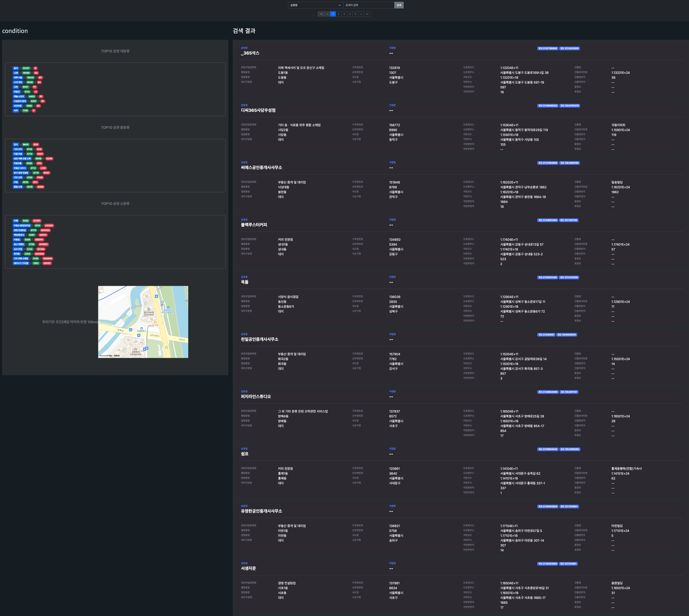
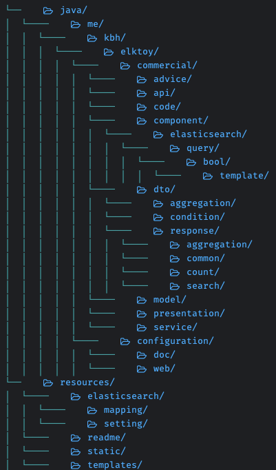
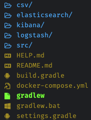

# ELKToy



### 개요
* 소상공인시장진흥공단에서 제공하는 공공데이터인 서울 상가 정보를 활용하여 ELK 스택을 활용한 프로젝트

### Study Article For Project
* [Elasticsearch란?](https://congruous-cup-ed8.notion.site/Elasticsearch-a7d5fdc4e59a4391abcc3a52ccaa14f3?pvs=4)
* [Elasticsearch의 구성요소](https://congruous-cup-ed8.notion.site/Elasticsearch-9563ca46127d41ad890ed414e699e920?pvs=4)
* [클러스터의 동작 원리](https://congruous-cup-ed8.notion.site/c81425951ecc4669b205ab4b6ab1cb5a?pvs=4)
* [인덱스의 상태 정보를 보자](https://congruous-cup-ed8.notion.site/1052c9c748924accb10d12173e755100?pvs=4)
* [Mapping](https://congruous-cup-ed8.notion.site/Mapping-2a54b599a3bc4925a3c7859b860506b3?pvs=4)
* [NRT (Near Real-Time Search)](https://congruous-cup-ed8.notion.site/NRT-Near-Real-Time-Search-952fd47656d84d14868fd03c3e2d00a8?pvs=4)
* [Elasticsearch의 Query DSL](https://congruous-cup-ed8.notion.site/Elasticsearch-Query-DSL-872ba67030124db7b081fcd570a1bf52?pvs=4)
* [Elasticsearch의 Aggregation](https://congruous-cup-ed8.notion.site/Elasticsearch-Aggregation-36ac7425027d4c0a8b0d761848d42986?pvs=4)
* [기타 자료](https://congruous-cup-ed8.notion.site/3311713fef9a44a1acf9a2206e3d05f2?pvs=4)

### Structure
* project directory structure
  * 
* root structure
  * 

### Data Setting

* 기초적인 테스트를 위해 1000개 정도의 데이터를 프로젝트 루트 경로 내 csv 디렉토리에서 제공합니다.
  * 
* 더 많은 데이터를 활용하여 진행해보기
    * http://naver.me/G1swn8Ui (전체 데이터 파일, 분할 파일로 구성)


## Quick Start

### Spring Boot
```
./gradlew clean build -x test -x testClasses bootRun
```

### docker-compose
```bash  
  docker-compose up -e ELK_VERSION=8.11
```

## Project Practice List
* Case 1
  * [case1 work branch](https://github.com/jvm-kbh/ELKToy/tree/spring-boot-3-setting) 
  * docker-compose.yml E,K config
  * spring data elasticsearch test
    * @Field
      * Elasticsearch Insert, search 구성
    * @Mapping
        * json file mapping
        * Elasticsearch Insert, search 구성  
* Case 2
  * [case2 work branch](https://github.com/jvm-kbh/ELKToy/tree/without-spring-data-elasticsearch)
  * with out spring data elasticsearch
  * Sample Search Page (thymeleaf)
  * 공공기관 실제 데이터 활용
* Case 3
  * branch
    * [case3 work branch](https://github.com/jvm-kbh/ELKToy/tree/without-spring-data-elasticsearch)
      * merge master
  * Elasticsearch 
    * Custom Request Builder    
    * Response Mapping dto
    * mapping, setting json
  * Logstash
    * mutate geo point
  * UI, script complete 
    * page event
    * map event
    * result event
    * search condtion  
  * Docker
    * Docker Compose 
      * change template for version argument